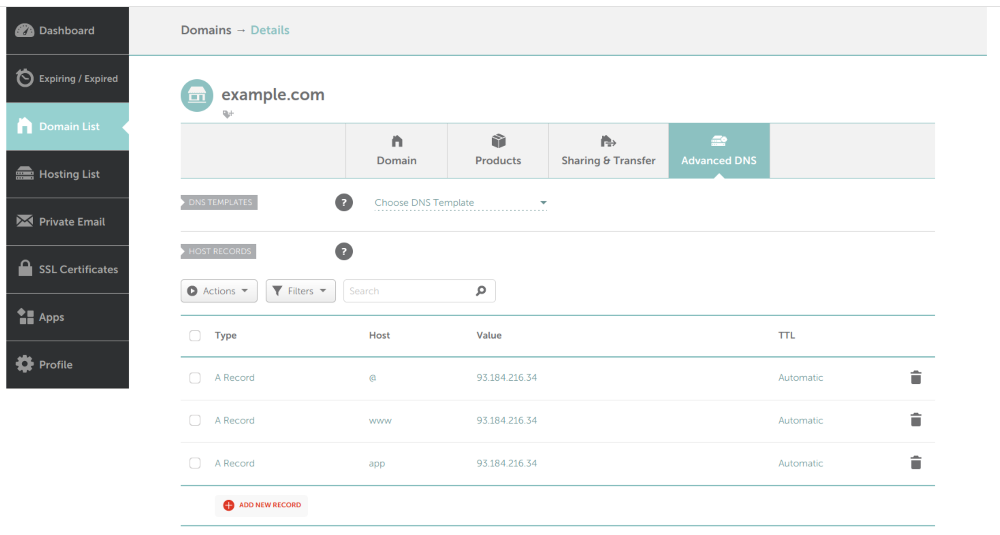
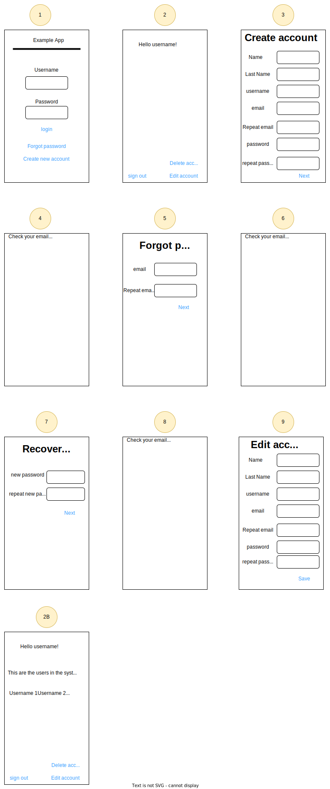

# A CTO playbook on a shoestring.

All the code in this blog post is in [github](https://github.com/nhatcher/users-template) and you should have a look at that first and come here only for further assistance.

In this blog post you are going to learn how to setup and deploy a simple web application with modern best programming practices and all the bells and whistles you need to grow the app from zero to a few hundred users.
There might be some things you want to do differently from code in here. You might want to use a different platform to read your logs, you might want to use nginx instead of caddy, you might want to run your django code with Daphne instead of gunicorn, you might decide GitHub is not good for you, or use a different email provider or host provider or get the domain name from a different name registrar. All good you will still be able to use this with minimal modifications. Changing Django and python for a different framework or programming language will require more changes but the core of this post will still be useful. Using [Lavarel](https://laravel.com/), [Ruby on Rails](https://rubyonrails.org/) or plain [go](https://go.dev/) should pose no big challenges to the reader.

This should not only be regarded as a tutorial on how to setup and install everything but as a guide on how to build a modern web application.

The guide is intended for a small team, maybe just one single person. If your team is larger than 5 people this guide might still work but might fall short in some respects. I am assuming you have almost no cash to dedicate to this project, we are going to do this on a shoestring. With all this in place if you make the project grow from a solo developer and no users to a few hundred users and 5 developer you will very easily upgrade the tools and hardware. I am assuming also you have some background in programming and you are comfortable in a Linux terminal. If you are not you really need a more technical partner that will help you with that. You will also not learn Django or python here although you should be ok if you know just some python and are willing to dedicate some time go go through the Django documentation.

Lastly we will not be setting the frontend here. All we are going to do here is completely frontend agnostic. You could do the whole frontend in vanilla HTML, CSS and JavaScript or use any modern framework like React and TypeScript.

After having setup toy webapps following similar patterns as we will be following here the idea of this project came when I join forces with Lu Bertolucci to work on his project 'feirou'. As I had some available time in my hand I thought this was a good moment to do this right.\

Many of the things that I will recommend here I learn from my coworkers during the past 14 years! I also have them to thank.

A brief note on nomenclature. I will assume that your username is 'jsmith', that your local's name computer is 'local', your remote name computer is 'remote', the name of the domain you bought is 'example.com' and that the ip in your VPS is '93.184.216.34'.
If you are following in Linux or Mac you will have no issues. If you are following in a windows machine and are working in the WSL it should be pretty straightforward. Otherwise you might need to tweak some commands for your own environment and OS. When you see a command like:

```
root@remote# apt install failban
```
means that you are running this command as root in the remote machine. And the remote folder is not important. Note that you know that it is a root user because the prompt ends with '#' and not with '$'. With this provisions I hope it is clear where are you running what command.

Finally, I will check links and versions. I will try not to link to third party blogs but prefer tools documentation. That said, links might be broken. I will always try to provide information about the link so you can search the internet easily.

## Getting a domain name (~10€ a year)

You can buy a domain name from places like [namecheap](https://www.namecheap.com/), but there are many other vendors. Just make sure that they only sell you the domain name and nothing else. It should cost you around 10€ a year. But you can find really cheap domain names for a year you can get for your testing. Beware of not renewing them, those cost go up and add!

## Getting an email account

There are several paid vendors like Google. But we will use [Zoho](https://www.zoho.com/mail/zohomail-pricing.html) that for now is free. Scroll down to the "forever free plan". You can use one provider now and move to a different one in the future. Because you own the domain name you will not need to change email addresses. The only problem you might have to deal with is exporting from Zoho and importing them again in the new platform if you ever want to do that.

Zoho has a nice web service and apps for Android and iOS to read and send your email from the phone.

To setup your email, you will need to follow the steps in one of these guides, [namecheap](https://www.namecheap.com/support/knowledgebase/article.aspx/9758/2208/how-to-set-up-zoho-email-for-my-domain/) or [zoho](https://www.zoho.com/mail/help/adminconsole/namecheap.html).

With this done you should be able to send a receive emails with your new fancy email address. You can up to 5 email accounts, for instance `hello@example.com` and `support@example.com` but you can configure zoho to get all emails on `hello@example.com`. You can also now send emails programmatically.

Now you should be able to send an email programmatically:
```python
import smtplib
from email.mime.text import MIMEText
from email.header import Header
from email.utils import formataddr

# Configure in zoho
password = "my secret password"
domain = "example.com"
sender_user = f"support@{domain}"


def send_email(email):
    # Define to/from
    subject = "First email ever!"
    sender_title = "Example App Support"

    # Create message
    msg = MIMEText(
        "Hello world!",
        "plain",
        "utf-8",
    )
    msg["Subject"] = Header(subject, "utf-8")
    msg["From"] = formataddr((str(Header(sender_title, "utf-8")), sender_user))
    msg["To"] = email

    # Create server object with SSL option
    server = smtplib.SMTP_SSL("smtp.zoho.com", 465)

    # Perform operations via server
    server.login(user, password)
    server.sendmail(user, [email], msg.as_string())
    server.quit()

if __name__ == "__main__":
    # who do you want to send the email to:
    to_address = "jsmith@example.com"
    send_email(to_address)
```

## Server provision and setup (~5€ a month)

This is by far the most complicated bit. But you only have to do it once.

Before even getting a VPS you need a pair of ssh keys. You probably have already done it for GitHub.

Your cloud provider will probably let you [upload your public key](https://docs.digitalocean.com/products/droplets/how-to/add-ssh-keys/to-team/) so that every new VPS will have the ssh key installed.

I am using an instance in [DigitalOcean](https://www.digitalocean.com/) basic droplets that at the time of writing are advertised as 4$/month but because of billing issues turns out to be around 4.5€ a month. This is enough for our purposes.
Other options are [Scaleway](https://www.scaleway.com/en/), [Linode](https://www.linode.com/), [Hetzner](https://www.hetzner.com/), and many others.

1. Secure the server

Log into the remote server. That is normally done by:

```
jsmith@local:~/ $ ssh root@93.184.216.34
```
Where `93.184.216.34` is just the example IP.


Install `fail2ban`:
```
root@remote# apt install fail2ban
```

Make sure you can only ssh with a key and not with a password. So `ssh root@93.184.216.34` only works form your computer with the private ssh key.

Install the firewall:
```
root@remote# apt install ufw
root@remote# ufw disable
root@remote# ufw default deny incoming
root@remote# ufw default allow outgoing
root@remote# ufw allow ssh
root@remote# ufw allow http
root@remote# ufw allow https
root@remote# ufw enable
```

Create a user and add it to the sudoers list. Make sure you can ssh with that user and remove ssh root access to the machine.

```
root@remote# adduser username
```

Where username is your username, for instance 'jsmith'. Add it to the sudoers list:

```
root@remote# usermod -aG sudo jsmith
```

As `jsmith` copy the contents of the root's `authorized_keys` file (usually at `/root/.ssh/authorized_keys`) to the username's `authorized_keys` file (`/home/username/.ssh/authorized_keys`). In a different terminal test that you can ssh as the new username:

```
jsmith@local:~/ $ ssh jsmith@93.184.216.34
```

Once in the remote computer check that you can become a superuser by typing `sudo su` and entering your password. Now keep your password safe and delete the contents of the root's `authorized_keys` file. The contents not the file.

Congratulations, you have secured your server. You should not be able to ssh as root anymore.

Now, there are still services running on your computer you might not be aware of. One of them is the OSI layer 3 echo ICMP server built in the operative system. For your laptop at home try:

```
jsmith@local:~/ $ ping -c 5 example.com
PING example.com (93.184.216.34) 56(84) bytes of data.
64 bytes from example.com (93.184.216.34): icmp_seq=1 ttl=52 time=26.0 ms
64 bytes from example.com (93.184.216.34): icmp_seq=2 ttl=52 time=30.1 ms
64 bytes from example.com (93.184.216.34): icmp_seq=3 ttl=52 time=24.4 ms
64 bytes from example.com (93.184.216.34): icmp_seq=4 ttl=52 time=25.7 ms
64 bytes from example.com (93.184.216.34): icmp_seq=5 ttl=52 time=27.8 ms

--- example.com ping statistics ---
5 packets transmitted, 5 received, 0% packet loss, time 4006ms
rtt min/avg/max/mdev = 24.359/26.784/30.122/1.988 ms
```

This is helpful to test if your computer is up and the network is listening. Note that we have not allowed the service in the firewall, yet it is there running. This is telling you that a round trip time for  ping request to your machine is around 26 milliseconds.

Your cloud provider might also feature some firewall settings. I don't think that setting a firewall both at the os level and at the cloud provider level would break anything but it's probably not a great idea since it might lead to difficult to debug issues. But you should go ahead and read about the firewall in your cloud provider and play with it a little bit. If you are using DigitalOcean in the control panel select Networking->Firewalls->Create Firewall. Once created you can _assign_ the firewall to the droplet in the firewall page. As usual DigitalOcean shines on good documentation. You could set some rules and see how they affect your droplet. Generally speaking though you should accept the ssh, https and icmp inbound rules and allow all outbound communication.


2. Point your domain name to your remote computer

We want your ip to point to your remote computer, this will buy us two things:

* We will be able to do `ssh jsmith@example.com` instead of using the ip
* Your friends will be able to visit `www.example.com` and land to your webpage!

We do this by configuring the DNS records in your DNS host provider. This is not difficult, but I bet you will have some stories to tell if you spend enough time configuring those.
Normally your domain registrar will provide you with a full featured GUI to config those DNS records in the _zone file_.

The only thing you have to do is to add a couple of `A Record`'s in your advanced DNS settings. If you are using Namecheap will look something like:


Note that we are adding three `A record`s:
* *`@` Record* directs the root domain ('example.com') to your IP
* *`www` Record* directs the subdomain 'www.example.com' to your IP
* *`app` Record* directs the 'app.example.com' to your IP 

We will do that to have our webpage sitting in <https://www.example.com> and our web application sitting in <https://app.example.com>.

You don't need to do this. You can have everything in the root domain <https://example.com> like <https://twitter.com> or <https://stackoverflow.com>. Having a different subdomain for the application can help with a number of issues:
* You can have other services in other subdomains independent of the application
* The webpage subdomain and the application subdomain do not share any cookies

On the other hand if you don't have other services or you have other domains for them and you don't need a flashy landing page you can go and use the root domain.

At the end of the day wether you want to have the application sitting in your root domain or a subdomain is your decision.


3. Set up a simple TLS secured webserver.

We will now install a webserver in your VPS capable of serving static webpages and redirecting traffic. Apache and nginx are fine options but will be using [caddy](https://caddyserver.com).

First thing you should do is download the latest binary for your computer architecture. You can follow the instructions [in the caddy documentation](https://caddyserver.com/docs/install) but we will install the latest binary here:

```
root@remote# wget https://github.com/caddyserver/caddy/releases/download/v2.7.4/caddy_2.7.4_linux_amd64.tar.gz
root@remote# tar -xf caddy_2.7.4_linux_amd64.tar.gz
root@remote# cp caddy /opt/caddy/
root@remote# chmod +x /opt/caddy/caddy
```

Remember that if you do this you will ned to maintain caddy version's yourself and be specially aware of security updates.

We will follow [caddy](https://caddyserver.com/docs/running).

Add an underprivileged user

```
root@remote# groupadd --system caddy
root@remote# useradd --system --gid caddy --create-home --home-dir /var/lib/caddy --shell /usr/sbin/nologin --comment "Caddy web server" caddy 
```

Create two directories:
```
root@remote# mkdir /var/www/api/
root@remote# mkdir /var/www/website/
```

Now get an `index.html` file in each of them:
```html
<!DOCTYPE html>
<html lang="en">
<head>
    <meta charset="UTF-8">
    <meta name="viewport" content="width=device-width, initial-scale=1.0">
    <title>Website/App</title>
</head>
<body>
The app is sitting in the website/app endpoint
</body>
</html>
```

Make sure that everything is readable by caddy:

```
root@remote# chmown -R caddy:caddy /var/www/
```

Create a Caddyfile:
```
example.com {
    redir https://www.example.com{uri}
}

www.example.com {
	root * /var/www/website/

	file_server
}

app.example.com {
	root * /var/www/app/

	file_server
}
```
This is redirecting all traffic from 'example.com' to 'www.example.com'. Anything coming from 'www.example.com' is being served from the directory `/var/www/website/` and 'app.example.com' is being served from `/var/www/app/`. As simple as that. In this case both subdomains are served from the same VPS, but that doesn't need to be the case. <https://www.example.com> could be served form a different machine, maybe done in wordpress or in modern days in webflow or anything else. You could use a static site generator like [Hugo](https://gohugo.io/) or [Zola](https://www.getzola.org/) or build it yourself if you are brave and host it in GitHub or [Neocities](https://neocities.org/) 

Finally run caddy:
```
root@remote# /opt/caddy/caddy run
```

If you did everything alright and I didn't forget any instruction by visiting <https://example.com> you should be redirected to <https://www.example.com>. If you visit <https://www.example.com> or <https://api.example.com> you should see your two different html files.

Big congratulations! Note: everything should be out of the box https and not http. This is one of the big advantages of using caddy. You can, of course, use other webservers like nginx and configurations will not be much more difficult.

This is all good and dandy. But we can't keep running caddy from the terminal like we are doing now, we need to run it as a service.

To do that create a `/etc/systemd/system/caddy.service` with the following content:
```
[Unit]
Description=Caddy
Documentation=https://caddyserver.com/docs/
After=network.target network-online.target
Requires=network-online.target

[Service]
Type=notify
User=caddy
Group=caddy
ExecStart=/opt/caddy/caddy run --environ --config /etc/caddy/Caddyfile
ExecReload=/opt/caddy/caddy reload --config /etc/caddy/Caddyfile --force
TimeoutStopSec=5s
LimitNOFILE=1048576
LimitNPROC=512
PrivateTmp=true
ProtectSystem=full
AmbientCapabilities=CAP_NET_ADMIN CAP_NET_BIND_SERVICE

[Install]
WantedBy=multi-user.target
```

Copy the Caddyfile to `/etc/caddy/Caddyfile`.

Then run to reload the system daemons and the caddy daemon
```
root@remote# systemctl daemon-reload
root@remote# systemctl start caddy.service
```

Now you are running caddy as a service and can shut down your laptop and go for pizza or beer because you had your first deployment. Your system is up and running!

One final note. In this post we are only interested in the 'app.example.com' part. But for us it will be a bit more complicated because we will not be just serving plain static html files. We will need Caddy to work as a proxy server. We will fix that issue in the coming sections.

4. Setup the Postgres database

In your production machine install Postgres and dependencies:

```
# apt install libpq-dev postgresql postgresql-contrib
# apt install build-essential python3-dev
```

Log into an interactive Postgres session by typing:

```
# su postgres
$ psql
```

Create a database in the Postgres prompt. Words in angle brackets ("<>" symbols) are placeholders that you should replace with actual values. For example, "\<database-user\>" could become "jsmith":

```
postgres=# CREATE DATABASE <database-name>;
postgres=# CREATE USER <database-user> WITH PASSWORD '<database-password>';
postgres=# ALTER ROLE <database-user> SET client_encoding TO 'utf8';
postgres=# ALTER ROLE <database-user> SET default_transaction_isolation TO 'read committed';
postgres=# ALTER ROLE <database-user> SET timezone TO 'UTC';
postgres=# GRANT ALL PRIVILEGES ON DATABASE <database-name> TO <database-user>;
```
Here we just follow the recommendations in the [Django documentation](https://docs.djangoproject.com/en/4.2/ref/databases/#postgresql-notes)

You can, of course use a different database like MariaDB, MySQL, Oracle, CockroachDB, Firebird, Microsoft SQL Server  or even MongoDB. We will be using SQLite in local development. Please have a good reason if you don't want to use PostgreSQL.

5. Create an underprivileged django user:
This is the user that will run the 
```
root@remote# groupadd --system django
root@remote# useradd --system --gid django --create-home --home-dir /var/lib/django --shell /usr/sbin/nologin --comment "Django app runner" django
```


## Local development and architecture

Now that we have setup the remote machine and is ready for our application let's turn our eyes how we are going to develop the application locally.

This bit I am going to show you now is not really standard but it is how I like doing local development. In a modern web application, there are two parts, the backend and the frontend. In general both parts have their own development servers. Those development servers are not production ready and they give you goodies like HMR (Hot Module Reloading). So during development most people will have two local servers running on their machines listening on two different ports (port-frontend and port-backend). People have designed all sorts of ways to work with this but I think a very simple one is to put caddy in front as a proxy server. Remember that caddy is just one small binary, there are no huge dependencies to install o weird things running on your laptop. At the beginning of your working day you can fire up a terminal and run

```
jsmith@local:~/Project/example$ caddy run
```

The Caddyfile could be something like:
```
:2080

# django API
reverse_proxy /api/* localhost:8000

# admin API
reverse_proxy /admin/* localhost:8000
reverse_proxy /static/admin/* localhost:8000

# everything else is the frontend 
reverse_proxy :5173
```

That means the frontend is running on port 5173 and the django backend will be running on port 8000 but our whole application will be running on port 2080. Now in a different terminal head over to the frontend folder abd run:
```
jsmith@local:~/Project/example/frontend_test$ python -m http.server 5173
```

For today this will our frontend server. In a later installment of this series we will substitute that with a fancy React aware, HMR featured, cache friendly development frontend server.

For now those two terminals will be mostly out of our way. 

You might have left wondering what those two entries in the Caddyfile about the django API are doing there. We will get to those later and see how we deal with that in production too.

We will have a very similar setting in production splitting the requests for static files from the API requests. It works in the following way. A remote machine (a browser) will make requests to our server sitting in <https://app.example.com> for example. There are two kinds of requests:

1. Static content like JavaScript files, HTML, CSS, images that are public
2. API calls that will need to be processed by the server

There are many websites, that are only of the first kind. They will just serve you the content you asked for. Personal websites and blogs are mostly of that kind.
You can host them for free on GitHub or [Neocities](https://neocities.org/) or many other places. You cannot login in those pages or consult a database or buy stuff. Those are called static websites and they are fairly easy to do.

The second kind of requests need a server, a program, to process some data and send some other data back. For instance a search engine will need to send a lits of URLs that contain some information. Many of those API calls are public, meaning everybody can use the service. Some might be private and only accessible if a user has logged in into the system.


## The app design and wireframes

Although today's aim is not the frontend we will build a frontend to have a fully functioning application. When designing an app or a website about the first things you need to do is the _wireframes_. Those are the low fidelity designs of what the application will do. Wireframes are not necessarily done by designers, they will probably came afterwards creating pixel perfect designs of your ideas.

There are many wireframing tools out there, but I will not mention any of them as I will leave that for our frontend discussions. For our purposes I will create the diagrams we need with <https://www.drawio.com/>.

Our web application will be as simple as possible. Users can:

* Log in and see, update and delete their personal data
* Log out
* Create accounts
* Recover password via email

Just the bare minimum that a world changing app needs to have. The frontend will be all done in HTML, modern JavaScript and CSS. No frills.

This are the wireframes:


When the user goes to our website <https://app.example.com>, three things can happen:
* If they are not logged in, you will see screen (1)
* If they are logged in as a normal user they will be greeted in screen (2)
* If they are admins they will see the list of users in the platform (2B)

I think the rest are pretty self explanatory. Notice that at this point we do not specify every single detail:
* What happens if you if you type a incorrect password?
* The real implementation might be quite different after a designer sees some of the wireframes and decides to change the UX here and there
* The exact wording will change
* ...

Now you can go over the [frontend_test](https://github.com/nhatcher/users-template/tree/main/frontend_test) folder and see the code there. We will not discuss it here.

## The database design
We finally get to the backend code and design. The first thing we need to think about is the database structure.

We obviously need a table with users that has to store username, an encrypted password, name, last name, email, ...
The users table might also include pictures, a telephone number and what not.
Things start getting more complicated when you realize you need to store session data. How do we know a user is already logged in? Also sites should be protected from _cross-ste request forgery_ or CSRF. And probably a couple of other issues we haven't thought just yet. That's when _django_ jumps in. Now, we are not going to design the authentication part of the database ourselves, we could, and we will probably do that on another occasion, but if we are using django, that is done for us. Of course Django's database schema might not be exactly what we want and we will need to adapt it for our own purposes.

We will extend Django's 'auth_users' with our own 'user_profile' table that will have a one to one link with Django users. This way we can add some extra information to every user without having to change the internal system. Also the framework doesn't have a way to create accounts or recover passwords. We will need to design that.

When someone creates an account it will be disabled until they click on the link that was send by email.
The way we will do this is to have a new table (model in the parlance of Django) called 'pending_users' that has a one to one link to a 'user' that is initially disabled. It will also contain the 'email_token'.

Another table 'recover_password' will contain the emails and email tokens send to those users that asked to recover their password.

And that's pretty much it for this project. In production we will be using a PostgreSQL database and we will use Sqlite3 in development.

## Setting up the django project

To begin with let's create a new folder for our application:

```
jsmith@local:~/Projects/$ mkdir example-app
jsmith@local:~/Projects/$ cd example-app
```

Now create a virtual environment for the project:

```
jsmith@local:~/Projects/example-app$ python -m venv venv
```

Where the second venv could be any name you like

Activate the virtual environment:

```
jsmith@local:~/Projects/example-app$ source venv/bin/activate
```

Install django:
```
(venv) $ pip install django
```
You will need to think a bit about the directory structure you want. In our case we want two directories in the root directory of out project ‘frontend’ or client and ‘server’. We will go ahead and create those two directories and move to the sever directory:
```
(venv) $ mkdir server
(venv) $ cd server
```

Now we create a django project in that directory:
```
(venv) $ django-admin startproject settings .
```

Note two things. We call the project ‘settings’. That is because we want to have a settings directory for the django admin. Also note the period and the end. This is to create the project in our current directory. We call it settings so that django places all config stuff in there.

There is a bit of configuration we still need to do. First we are going to use different setting for production and local development:

* We don't want to send real emails
* We don't want to send logs to our log backend. We will probably be happy seeing the emails  and the logs in our terminal.
* We don't want a PostgreSQL database while development. SQlite3 will do just fine.
* We want HMR while development and full stack traces
* We don't need access to secret keys

See the [source code](https://github.com/nhatcher/users-template/tree/main/server/settings/settings) to understand the specifics.


## The users or accounts app

A Django project revolves around the concept of apps. A Django application is a self-contained unit that encapsulates specific functionality within a Django project. Django apps are designed to be reusable and can be plugged into different projects, which makes them a fundamental building block of Django web development.

Almost every project is going to need an accounts or users app. The bulk of the code we will write today is in this app. This is our first stop:
```
(venv) $ python manage.py startapp users
```
In this app we need to define:
1. *Models*: Models define the structure and behavior of the database tables for your app. Each model corresponds to a table in the database and includes fields (representing table columns) and methods for interacting with the data. In our example, "user_profile," "pending_users," and "recover_password" are all appropriate names for models. Models are a critical part of your app, as they determine how data is stored and manipulated.
2. *URLs (URL Routing)*: The URLs module in your app defines the URL patterns or routes for your app's endpoints. These patterns map specific URLs to views within your app.
3. *Views*: Views are responsible for handling HTTP requests and returning HTTP responses. They contain the logic for processing data, rendering templates, or returning data in formats like JSON. Views determine what happens when a specific endpoint is accessed. It's essential to provide details about how views interact with the URL routing and how they respond to different HTTP methods (e.g., GET, POST).
4. *Tests*: everything within the app should be thoroughly tested. This is a crucial aspect of Django development
5. *Admin*: The admin module is where you can define custom configurations for your app's models within the Django admin interface. You can specify how your models should be displayed and edited by administrators. This is particularly useful for managing app-specific data through the admin panel.

Once all the code is in place we are ready to test the app locally! Just need to create the migrations and run them:

```
(venv) $ python manage.py makemigrations
(venv) $ python manage.py migrate
```

Once that is done if your caddy proxy server is running and your python frontend server is running you just need to:
```
(venv) $ python manage.py runserver
```
And head over to <https://localhost:2080/> to see your application. You should also see the Django admin page at <https://localhost:2080/admin/>

Note the database file `db.sqlite3` will be sitting along side `manage.py` and you can check it. You can open that file with the `sqlite3` cli, use a sqlite browser like [SqliteStudio](https://sqlitestudio.pl/) or simply use a VS Code [Sqlite Viewer](https://marketplace.visualstudio.com/items?itemName=qwtel.sqlite-viewer). In either case to be able to log in the Django admin panel you will need to be a superuser. Using the CLI:

```
$ sqlite3 db.sqlite3 
SQLite version 3.37.2 2022-01-06 13:25:41
Enter ".help" for usage hints.
sqlite> UPDATE auth_user SET is_superuser=TRUE WHERE username="jsmith";
```

Or you can create a superuser with:
```
(venv) $ python manage.py createsuperuser
```

As stated above tests are a crucial component of a Django application and, in fact, are vital for any computer program. They are essential for ensuring that the software works correctly and reliably, regardless of the specific technology or framework being used. Ti run the tests here:
```
(venv) $ python manage.py test
```

Remember that the `manage.py` uses the development settings by default.

Typically there might be as many lines of code for tests as there are for production code. And you will need to think them thoroughly. Focus on testing the logic first, not on lines of code covered. It's very easy, although sometimes cumbersome, to test every line of the code but to miss important logical branches of the code. It is very easy to skip tests on a first proof of concept, thinking you might rewrite this properly in the future. In my experience that is not normally how things go down. You start writing a bit of code for a proof of concept and that code ends ups growing out of hand with a bad foundation. A good part of the reason for this blog post and code is to help you get started in a project with a solid foundation.

You should spend some time understanding how the tests work. In many situations you are going to find yourself thinking a piece of code is difficult to test. That might be so, refactor, make the thing testable. At times you will need to mock a part of the application, we don't want to send real emails in tests or we don't really have a browser. You will need to think how to do that in a clean way. Specially at the beginning of the development you shouldn't focus on test coverage, trying to cover every line of code and it is ok to leave some parts out rather than install complicated frameworks that will help you testing weird corner cases. Sometimes tests that way end up being a heavy luggage. As long as the testing framework is in place and you have an easy system to add new tests and you are covering the main logical branches of your code you are ready to take off.

Enough about tests for now, we will meet them again in a later section dedicated just for them.


## The type checker, the formatter and the linter

Python is showing it's age and doesn't have many of the features that are now taken for granted in more modern languages. In particular it doesn't have types, meaning it's very easy to call a function with incorrect types, for example. Because of this there is a growth in tools that intend to patch the issues in different ways. Picking a particular set of tools and configuring them correctly might be overwhelming.

What I describe here is just one selection, as long as you are checking types, adhering to a style guide and having a code formatter.

We will use [pyright](https://microsoft.github.io/pyright/#/) by Microsoft for the type checker. There are many other options, [mypy](https://www.mypy-lang.org/) is the reference type checker but mymy seems to be having many issues with Django.

We will use [black](https://github.com/psf/black) for our code formatter and [flake8](https://flake8.pycqa.org/en/latest/) to enforce a style guide. We will also use [isort](https://pycqa.github.io/isort/) to order our imports consistently.

You will need to run this tools every time you commit code to the repository and make sure that code is conformant.

```
(venv) $ pip install pyright
(venv) $ pip install black
(venv) $ pip install flake8
(evnv) $ pip install isort
```

I leave the configuration options and settings for you, but you can find ours in [.flake8](https://github.com/nhatcher/users-template/blob/main/.flake8) and [pyproject.toml](https://github.com/nhatcher/users-template/blob/main/pyproject.toml). Note that you need to run isort in the black compatibility mode.


## Tests, test runner, test coverage and GitHub actions

We will use [pytest](https://docs.pytest.org/) and [pytest-cov](https://pypi.org/project/pytest-cov/). To install this:
```
(venv) $ pip install pytest
(venv) $ pip install pytest-django
(venv) $ pip install pytest-cov
```

This is a nicer way to run the tests than running `python manage.py test` for a number of reasons, richer test discovery, more concise syntax, you can do parametrized testing, parallel test execution, custom test makers and use plugins like the coverage tool we will be using.

Running:
```
(venv) $ pytest --cov-report term-missing --cov server
```

Will run all your tests, run a test coverage and tell you which lines are not yet covered.

This is the important bit, all test need to pass before merging more work into the main branch. This includes not only the Django tests but also the type checker, formatter and linters. I have put all of them in the [run_test.sh](https://github.com/nhatcher/users-template/blob/main/run_tests.sh) executable.

## Logs, alerts, notifications and stats

Logs are messages emitted by the application or the operative system that can help us trace back errors or issues that happened through an event or series of events.
It can be informative, signal a warning or be worrisome errors.

Alerts are messages that we receive in our phones. We probably need to act on them. They signal a house on fire event.
Notifications are also messages that we receive in our movil devices that are just for our information, for example new accounts created.

Some logs may be updated to alerts or notifications depending on their importance.

Stats are numbers of certain occurrences that we feel are important. Like number of accounts created or the number of times people logged in into the system.


## Refinements:

1. Cron jobs:
* Clean database

2. unattended updates. Caddy updates

3. Vaults and secrets. Terraform vault.

4. Staging server(s)
You might want to have a staging server in <https://staging.example.com>. If you want to be safer you can do it using random subdomains: <https://sleigh_year.g.example.com>. You can copy the data from production. Droplets are cheap for a few hours or days.


## Extra A: A VPN with Wireguard

## Extra B: Deployments on tagging

## Extra C: Code defines infrastructure.

Using Terraform and Puppet


